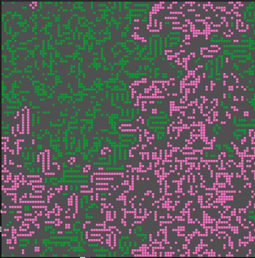
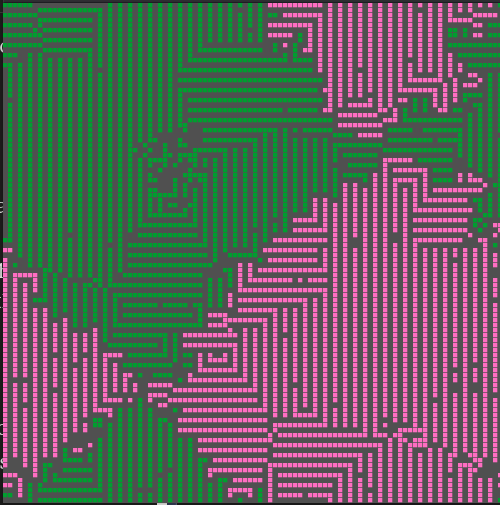
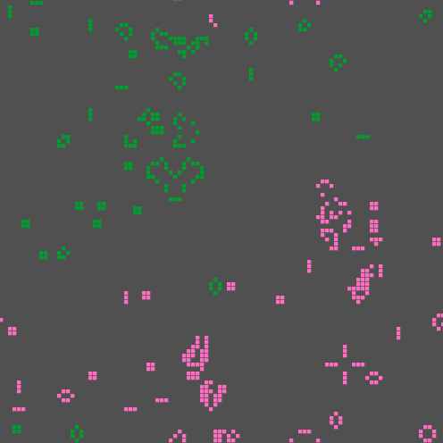

<a id="readme-top"></a>

<!-- TABLE OF CONTENTS -->
<details>
  <summary>Table of Contents</summary>
  <ol>
    <li>
      <a href="#about-the-project">About The Project</a>
    </li>
    <li>
        <a href="#intresting-cases">Intresting Cases</a>
    </li>
    <li>
      <a href="#getting-started">Getting Started</a>
      <ul>
        <li><a href="#prerequisites">Prerequisites</a></li>
        </ul>
    </li>
    <li><a href="#usage">Usage</a></li>
    <li><a href="#contributing">Contributing</a></li>
    <li><a href="#license">License</a></li>
    <li><a href="#contact">Contact</a></li>
     </ol>
</details>

<!-- ABOUT THE PROJECT -->
## About The Project

Cellular automata battle sim wt 2 factions based on conways game of life,where both faction fight a war of attrition.

Both factions spawn diagonally on a 100x100 grid universe as 25px radius circles.

All rules of conways game of life are followed with an additional rule that contact for 2 species leads to annialation.


<p align="right">(<a href="#readme-top">back to top</a>)</p>

## Intresting Cases

1.Underpopulation threshold reduced to 1 neighbour from 2 neighbours.Organic looking structures near border that are static.

<p align="center">
    
</p>

2.Underpopulation threshold removed.Game oscillates to reach a knarly looking static state.

<p align="center">
    
</p>

3.Normal.Looks like fungi in a petri dish.
<p align="center">
    
</p>

<p align="right">(<a href="#readme-top">back to top</a>)</p>


<!-- GETTING STARTED -->
## Getting Started

### Prerequisites

This project requires raylib and its associated libraries.
<!-- USAGE EXAMPLES -->
## usage
````
# Clone the repo
git clone https://github.com/Clumsyoof/conways-game-of-death
cd conway_battle

# Create and enter build directory
mkdir build && cd build

# Generate Makefiles and compile 
cmake ..
make 

````

<p align="right">(<a href="#readme-top">back to top</a>)</p>


<!-- CONTRIBUTING -->
## Contributing

Any contributions you make are **greatly appreciated**.

If you have a suggestion that would make this better, please fork the repo and create a pull request. You can also simply open an issue with the tag "enhancement".
Don't forget to give the project a star! Thanks again!

<p align="right">(<a href="#readme-top">back to top</a>)</p>


<!-- LICENSE -->
## License

Project is unlicensed,do whatever you want with it.

<p align="right">(<a href="#readme-top">back to top</a>)</p>


<!-- CONTACT -->
## Contact

Advik.k -[LinkedIn](https://www.linkedin.com/in/advikkaushik06/) - advikkaushik478[at]gmail[dot]com
Project Link: [https://github.com/Clumsyoof/conways-game-of-death](https://github.com/Clumsyoof/conways-game-of-death)

<p align="right">(<a href="#readme-top">back to top</a>)</p>
